<div align="center">

# NetSpace

**Meet the people who are in the same café as you, right now.**

A location-based social app for cafés. Visitors scan the venue's QR code, pass a GPS check, and can then see who else is there and chat with them. Nothing is kept after they leave.


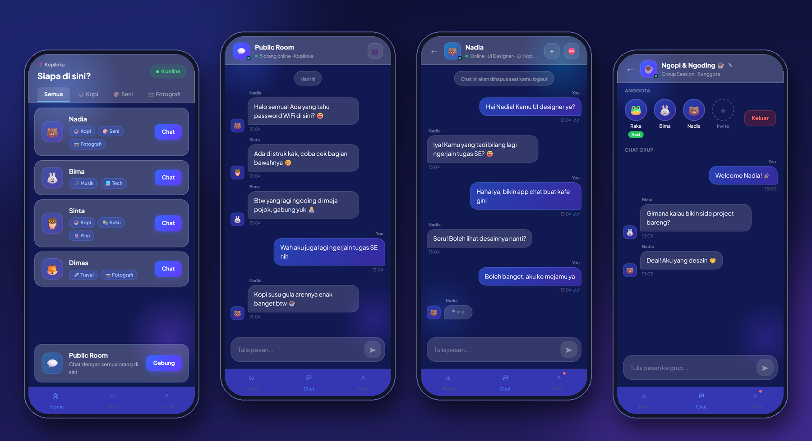

**Web client (this repo)** · [Go backend](https://github.com/Kristantowinata/netspace-backend)

</div>

---

## Contents

- [The idea](#the-idea)
- [Screenshots](#screenshots)
- [Features](#features)
- [How it works](#how-it-works)
- [Tech stack](#tech-stack)
- [Run it locally](#run-it-locally)
- [Configuration](#configuration)
- [Project structure](#project-structure)
- [Security and privacy](#security-and-privacy)
- [Team](#team)

## The idea

People sit next to each other in cafés every day without ever talking. Global social apps don't help with that because they connect you to people *anywhere*. NetSpace only connects you to people *here*:

1. **Scan** the QR code on the table.
2. **Prove you're on site**: the browser's GPS has to place you inside the café's geofence.
3. **Check in** with a display name and a few interests. No account, no password.
4. **Chat** in the café's public room, privately one-to-one, or in small groups.
5. **Leave**: walk out of the geofence or go idle for 30 minutes and the session ends. Your chats are deleted.

Café owners get an admin panel with live analytics, the list of active visitors, moderation tools, and a printable QR code for their venue.

## Screenshots

### Visitor app (mobile)

| Location gate | Check-in | Interests |
|:---:|:---:|:---:|
| 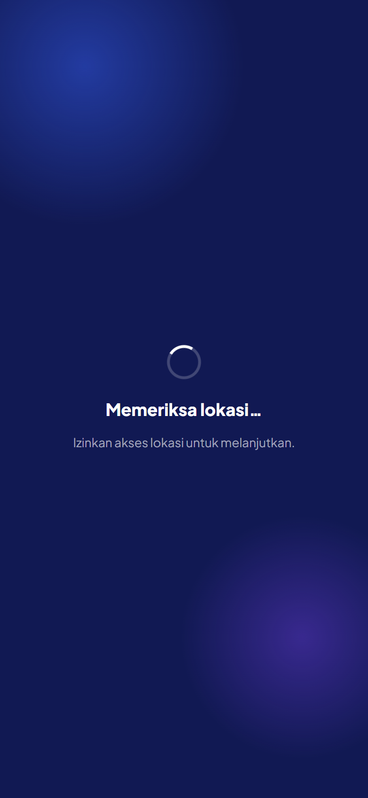 | 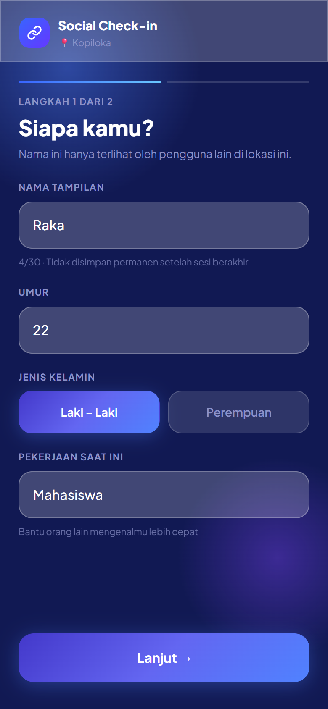 | 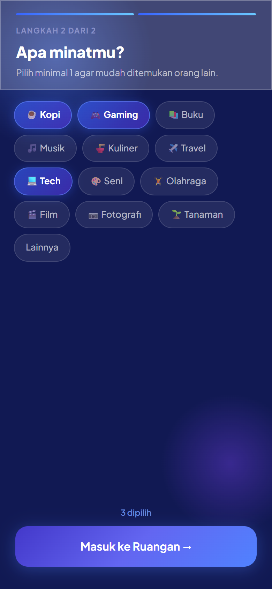 |
| **Who's here** | **Public room** | **Direct message** |
| 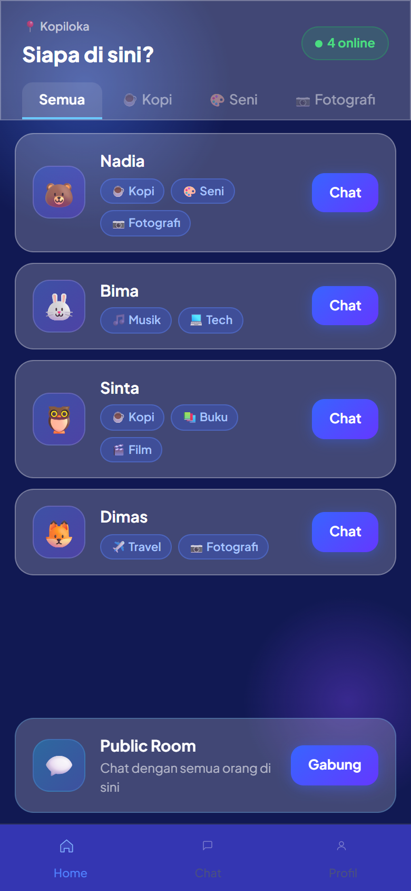 | 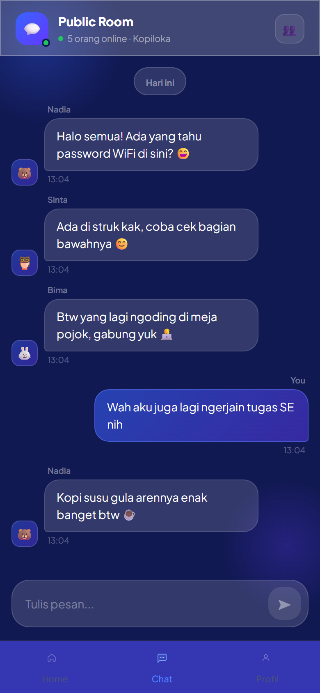 | 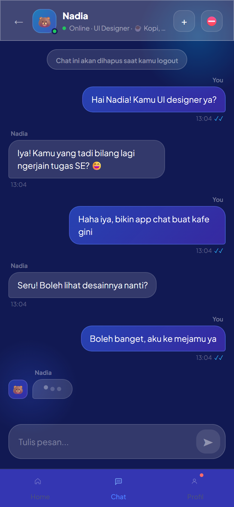 |
| **Group chat** | **Chat list** | **Notifications** |
| 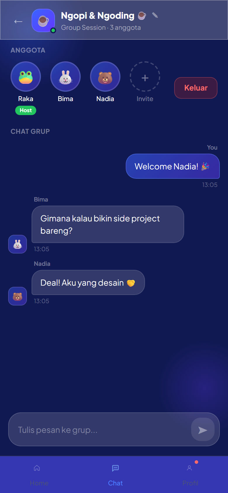 | 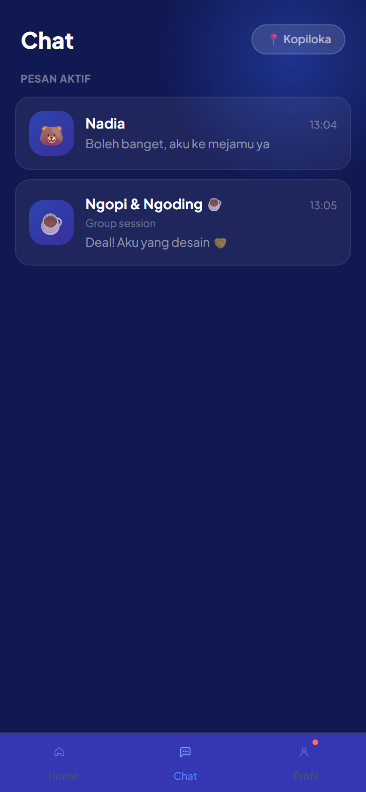 | 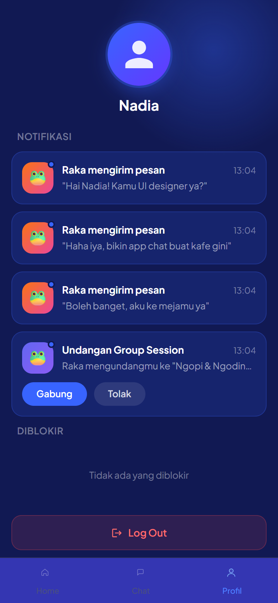 |

### Admin panel (desktop)

| Analytics | Active users |
|:---:|:---:|
| 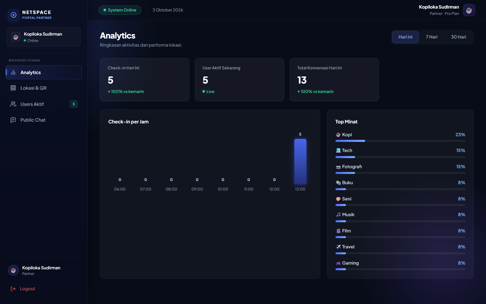 | 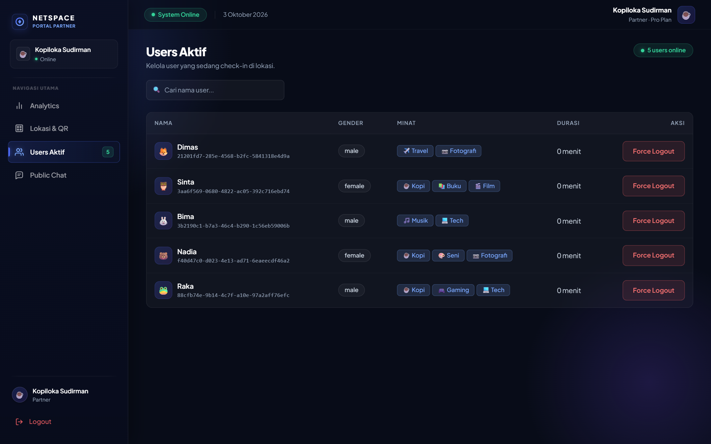 |
| **Location & QR** | **Public chat moderation** |
| 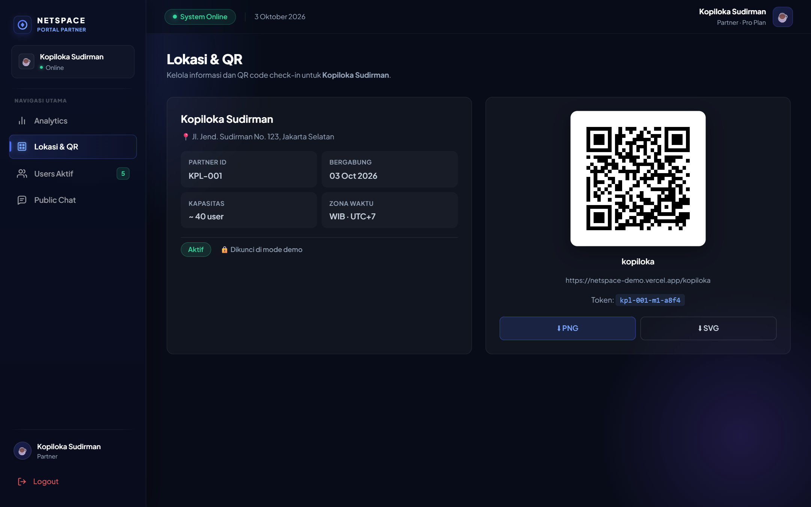 |  |

<details>
<summary>Admin login (demo mode)</summary>

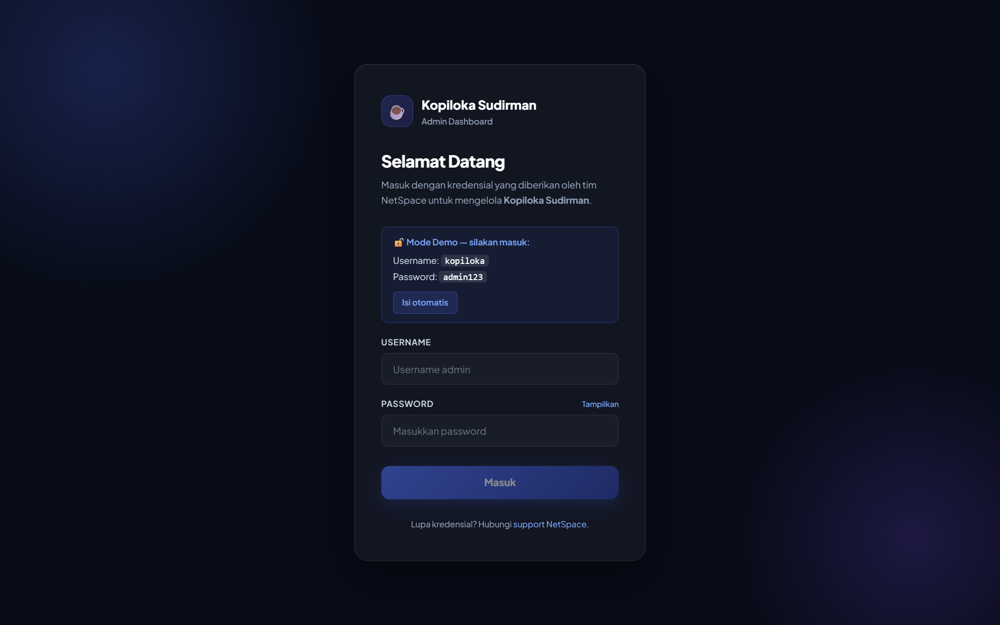

</details>

## Features

### For visitors
- **GPS location gate.** You can only enter while physically inside the venue's geofence, and you're signed out when you leave it.
- **Who's here.** A live list of people at the café with their interests, filterable by interest and updated in real time as people join and leave.
- **Public room.** One shared chat per café. Messages are kept for 24 hours.
- **Direct messages** with typing indicators and read receipts (grey ✓✓ when sent, blue once read).
- **Group chats.** Start one from a DM, rename it, invite people, accept or decline invites, leave.
- **Notifications** for new DMs and group invites, plus an in-app toast.
- **Block** someone for the rest of the session.
- **Ephemeral by design.** Logging out wipes your messages, and the session also ends after 30 minutes idle or when you leave the geofence.

### For café admins
- **Analytics.** Check-ins today vs yesterday, users online right now, conversations today, check-ins per hour (WIB), and the most popular interests.
- **Active users.** Search the visitor list and force-logout anyone with a reason.
- **Location & QR.** Venue details, an on/off switch for check-ins, and a QR code you can download as PNG or SVG.
- **Public chat moderation.** Read the room in real time, post as the venue, or clear it.

## How it works

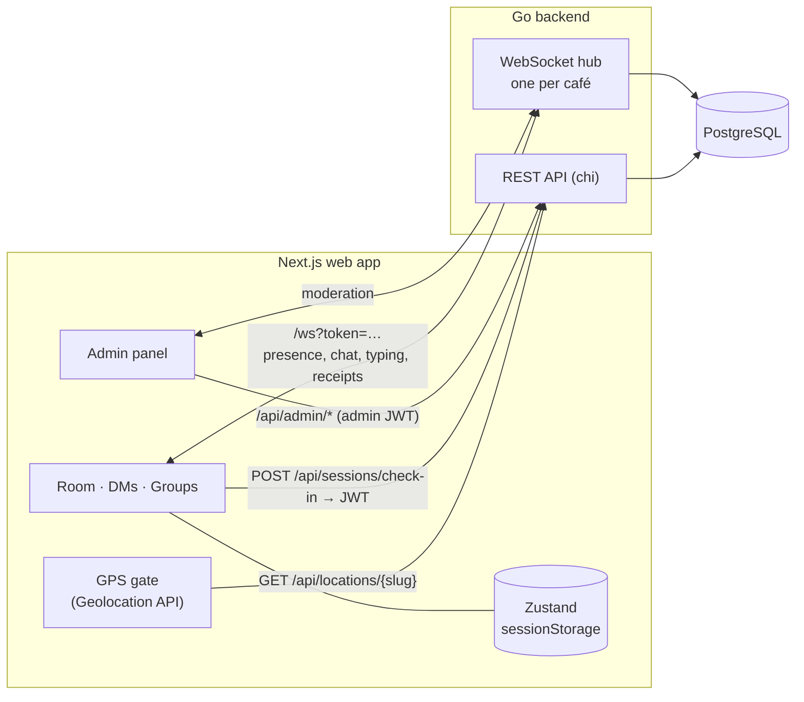

- **One WebSocket per tab**, shared by all pages through a singleton client (`lib/ws.ts`) that reconnects automatically. Pages subscribe to typed events with a `useWsEvent` hook. The wire types in `lib/wsTypes.ts` mirror the Go `api` package.
- **REST handles state you load once**: check-in, venue info, chat history, notifications and all admin data. **The socket handles everything live**: presence, messages, typing, read receipts, group events, force-logout.
- **The geofence check runs on the client.** The gate (`app/[location]/page.tsx`) and the background logout hook (`lib/useGeofenceLogout.ts`) share the same logic in `lib/geofence.ts`, which takes GPS accuracy into account so a jittery fix doesn't kick out a visitor who is actually inside.
- **The session lives in `sessionStorage`**, not `localStorage`, so closing the tab really ends it.

## Tech stack

| Area | Technology |
|---|---|
| Framework | Next.js 16 (App Router, Turbopack) |
| UI | React 19, TypeScript (strict) |
| Styling | Tailwind CSS 4 and scoped `styled-jsx` |
| State | Zustand 5 with `sessionStorage` persistence |
| Realtime | Native WebSocket client (singleton, auto-reconnect) |
| Location | Browser Geolocation API with a haversine distance check |
| QR codes | `qrcode.react` (PNG and SVG export) |
| Backend | Go, chi, gorilla/websocket, PostgreSQL. See the [backend repo](https://github.com/Kristantowinata/netspace-backend) |

## Run it locally

You need **Node.js 20+** and the [backend](https://github.com/Kristantowinata/netspace-backend) running (by default on `http://localhost:8080`, with PostgreSQL).

```bash
git clone https://github.com/Kristantowinata/netspace-frontend.git
cd netspace-frontend
npm install
```

Create `.env.local`:

```bash
NEXT_PUBLIC_API_BASE_URL=http://localhost:8080   # Go backend (REST + WebSocket)
NEXT_PUBLIC_APP_URL=http://localhost:3000        # used to build the venue QR links
```

Start the dev server:

```bash
npm run dev
```

Then open a seeded venue such as **http://localhost:3000/kopiloka**. The admin panel is at **http://localhost:3000/kopiloka/admin/login**. The seeded demo admin logins are listed in the [backend README](https://github.com/Kristantowinata/netspace-backend#database-and-seed).

| Script | What it does |
|---|---|
| `npm run dev` | Dev server on port 3000 |
| `npm run build` / `npm start` | Production build and serve |
| `npm run lint` | ESLint |

> **Geolocation needs a secure context.** It works on `localhost` and on any HTTPS domain, but not on a plain-HTTP LAN IP. To try it on a phone, deploy it or use an HTTPS tunnel.

## Configuration

### Environment variables

| Variable | Required | Description |
|---|:---:|---|
| `NEXT_PUBLIC_API_BASE_URL` | ✅ | Backend base URL. The WebSocket URL is derived from it (`https` becomes `wss`). |
| `NEXT_PUBLIC_APP_URL` | ✅ | Public URL of this app, encoded in the venue QR codes (`<APP_URL>/<slug>`). Falls back to the current origin. |

`NEXT_PUBLIC_*` values are inlined at build time, so rebuild after changing them. `.env*` files are git-ignored.

### Demo mode (`lib/demo.ts`)

With `DEMO_MODE = true` anyone can try the app from anywhere:

- the location gate anchors itself to the **visitor's own position**, so you get in wherever you are. Walk about 150 m away and you are still logged out, so the geofence feature stays visible;
- the admin login shows the demo credentials;
- the admin "location active" switch is locked so a tester can't close check-in for everyone else.

Set `DEMO_MODE = false` for a real venue: strict per-café geofence, no credential hint, working switch.

<details>
<summary><b>Geofence settings (<code>lib/geofence.ts</code>)</b></summary>

Each café row in the backend `Locations` table has `latitude`, `longitude` and `geofenceRadius` (meters). The client reads them from `GET /api/locations/{slug}`.

| Setting | Purpose |
|---|---|
| `GEOFENCE_TEST_MODE` | `false` is for production: accuracy-aware, and if no GPS fix arrives the visitor is let in rather than blocked. `true` is for testing: raw distance, so small radii behave predictably, and no fix means blocked. |
| `GEOFENCE_OVERRIDE` | One `{ lat, lng, radius }` applied to **every** venue, handy for testing at your desk. Set it to `null` to use each venue's database coordinates. |

To get a coordinate, right-click a spot in Google Maps (the first menu item is `lat, lng`), or run this in the browser console:

```js
navigator.geolocation.getCurrentPosition(p => console.log(p.coords.latitude, p.coords.longitude));
```

For a real café use a radius of **30–50 m**. Phone GPS is typically accurate to 10–30 m, so a smaller radius will wrongly block people who are inside.

</details>

<details>
<summary><b>Deploying to Vercel</b></summary>

1. Import the repo into Vercel (Next.js is auto-detected).
2. Set `NEXT_PUBLIC_API_BASE_URL` to the deployed backend and `NEXT_PUBLIC_APP_URL` to the Vercel URL.
3. Deploy. HTTPS is automatic, which phones need for geolocation.
4. Each café prints **one** static QR code from *Admin → Lokasi & QR*. It doesn't need to be secret: access is controlled by the GPS geofence, not by the QR code.

</details>

## Project structure

```
app/[location]/            Every page is scoped by café slug
  page.tsx                 GPS location gate (QR landing page)
  identity/  interests/    Two-step check-in
  room/  room/public/      Who's here + public room
  chat/[userId]/           Direct message
  group/[groupId]/         Group chat
  chats/  profile/         Chat list, profile, notifications, blocked users
  admin/                   Login, analytics, users, location & QR, public chat
components/                UI building blocks (chat bubbles, modals, admin widgets…)
lib/
  ws.ts  wsTypes.ts        WebSocket client, hooks and wire types
  geofence.ts              Geofence config and distance helpers
  useGeofenceLogout.ts     Logs out when you leave the venue
  useIdleLogout.ts         Logs out after 30 minutes idle
  demo.ts                  Public demo switch
services/adminApi.ts       Admin REST client
store/                     Zustand stores (visitor + admin)
```

## Security and privacy

- **No accounts, no passwords for visitors.** A check-in returns a short-lived JWT (8 h) kept in `sessionStorage`. Logging out revokes it on the server and deletes that visitor's chat data.
- **Presence is tied to place and time.** The GPS gate, logout on leaving the geofence, logout after 30 minutes idle, and a 24-hour retention window for the public room.
- **Admins are scoped to their own café**, and their passwords are stored as bcrypt hashes on the backend.
- **No secrets in the client or the repo.** The only build-time values are public URLs, and `.env*` is git-ignored.
- **Before running it for real**, turn off demo mode, set real venue coordinates, replace the seeded admin passwords, and add a short privacy notice. The app uses precise location, a display name and an age.

## Team

Built as a Software Engineering team project at BINUS University (semester 4).

| Member | Focus |
|---|---|
| **Kristanto Winata** ([@Kristantowinata](https://github.com/Kristantowinata)) | Entire web client (visitor app, admin panel, realtime client, geofencing, demo mode); backend work on group chat, read receipts, geofence data, public-room history, admin chat moderation and deployment |
| [@latoiste](https://github.com/latoiste) | Backend core: WebSocket hub, chat, REST API, JWT auth |
| Kevin Nathanael Limarga | Admin API, analytics queries and database schema |

## License

Shared for portfolio and educational purposes. All rights reserved by the authors.
